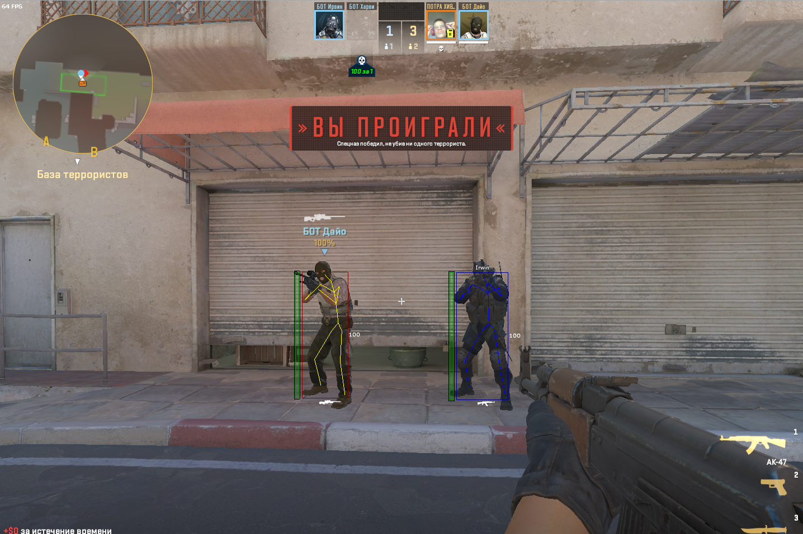

## CS2 Undetected Cheats/Hacks

### Description

External CS2 Cheats to bypass VAC

### Features

#### AimBot

- Key activation with RCS (default = LBUTTON)
- Visibility check

#### Esp

- Skeleton (Color team)
- Box with health bar
- Health numbers
- Name
- Enemy weapon icon (_**for correct work of icons it is necessary to install the font you download in Releases**_)
- Enemy flags (Scoped, Flashed, Shifting, Shifting in scope)
- Team Check (if you want to see only enemies or teammates, you can change it in the config file)

#### Other Visuals

- Aim Crosshair
- [Bomb timer](https://streamable.com/ylouzc)

#### Trigger Bot

- Key activation (default = LAlt)
- [No Spread](https://streamable.com/9ltv4n)

#### Miscellaneous

- [BunnyHop](https://streamable.com/3r09m1) ( [Read this](https://github.com/sweeperxz/FullyExternalCS2/blob/151355b47373acdc3ccaa6f526e94388c4e71f2b/Data/Entity/Player.cs#L64) )
- OBS Bypass
- Hitsound (**_in the same folder with the cheat there should be a file called "hit.wav"_**)
- Basic Config with hotkeys. (if you want to change the default keys watch link and replace keycode whatever u
  want [Read this](https://github.com/lolp1/Process.NET/blob/ce9ac9cceb2afb30c9288495615c6f3aa34bc1f8/src/Process.NET/Native/Types/NativeEnums.cs#L235))

#### System

- Auto update offsets

### Getting started
Download EXE from [releases](https://github.com/bentaygaa/CS2-Undetected-Hacks/releases/latest)
Please disregard anti virus false positives, please disable Windows defender
